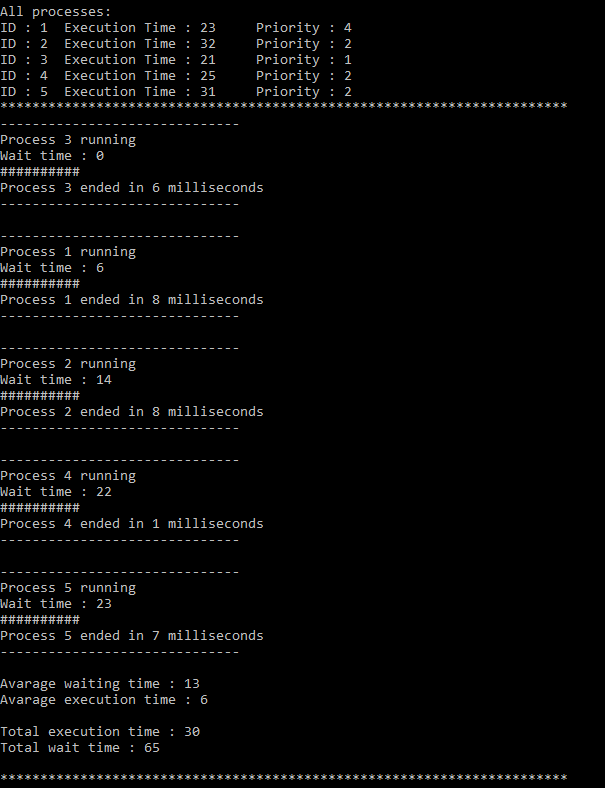
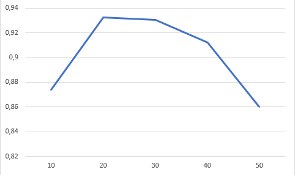

# OS Lab 3 - Process Scheduler Simulator


## Main part


Задание нашей лабораторной работы -создать симулятор планировщика процессов, который может организовать различные процессы в порядке их выполнения системой.

Мой вариант 6 **Алгоритм Fbn (Foregraund Backgraund).**
### Немного теории
**(Foregraund Backgraund)**. Алгоритм має N черг. Вхідний потік заявок поступає в першу чергу. Із черг заявки поступають на виконання. Якщо заявка за відведений квант часу не встигла завершитися, то вона повертається в чергу i+1, де i – черга з якої заявка була взята. З найбільш високим пріоритетом черга №1. Черга i обслуговується, якщо порожні всі черги котрі менші за i. Починаючи з 2-ої черги заявки сортуються за пріоритетом (0 пріоритет &lt; 1 пріоритету). Квант часу для заявки визначається по формулі 2i-1, заявка з останньої черги обслуговується стільки часу, скільки їй необхідно до завершення.
### Структура процесса

**ID**-идентификатор процесса.

**ExecTime**-время выполнения процесса(в миллисекундах).

**WaitTime**-время ожидания процесса до его выполнения(в миллисекундах).

**Counter**-вспомогательная переменная для задавания идентификаторов процессов.

**AllExecTime**-все время выполнения процесса(в миллисекундах).

**AllWaitTime**-все время ожидания процесса до его выполнения(в миллисекундах).

**Priority**-приоритет выполнения процесса.

### Основные функции

**Process()**-Конструктор который задает идентификатор процесса, время его выполнения и приоритет(время и приоритет задается случайно).


**static int CompareByPriority(Process proc1, Process proc2)**-функция для сортировки списка по приоритету выполнения процесса.


**public void print()**-функция для вывода идентификатора процесса, времени его выполнения и приоритет


**public void Execute()**-подсчитывает время ожидания процесса, обновляет значения AllExecTime и AllWaitTime,"выполняет" процесс и выводит информацию о начале выполнения и завершения процесса


**public void AddProcesses(int n)**-добавляет в список процессов n-ое количество процессов


**public void start()**-выводи иформацию про все процессы, их обработку, среднее время ожидания\выполнения процессов, все время ожидания\выполнения процессов


### Пример работы

##### Код
```
    ProcessManager test = new ProcessManager(20);
            test.AddProcess(5);
            test.Start();  
```




### Графики

##### График зависимости среднего времени ожидания от интенсивности входящего потока заявок


##### График зависимости процента простоя ресурса от интенсивности входящего потока заявок.



##### График зависимости количества заявок от времени ожидания при фиксированной интенсивности входящего потока заявок.


